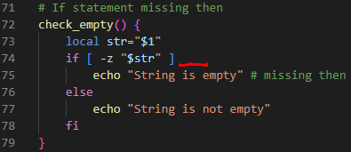

# SCRIPT4.SH - Code Debugs and Fixes

---

## ERROR #1 (Type Logical): Line 24 --> Calculating the word count average by dividing with a denominator value of zero (0).

**1. Original Code:**

**2. Fix: Calculate the average using the ***line_count*** variable instead**

---

## ERROR #2 (Type Syntax): Line 43 --> Missing closing curly backet for function `find_longest()` 

**1. Original Code:**

**2. Fix: Apply `}` at end of the function**

---

## ERROR #3 (Type Logical): Line 64 --> Counter variable increasing by 1, instead of decreasing by 1

**1. Original Code:**

**2. Fix: Change operator symbal to `-` from `+`**

---

## ERROR #4 (Type Syntax):  Line 74 --> Malformed `if-else` statement block

**1. Original Code:**

**2. Fix: Added missing `; then` expression in the conditional statement block**

---
---

## FIXED CODE OUTPUT

Below is the output result of the corrected Shell 

